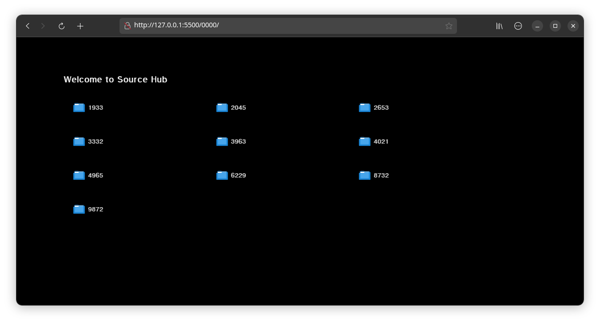

  <table align="center">
    <tr align="center">
      <th>Title</th>
      <th>Description</th>
    </tr>
    <tr align="center">
      <td>Source Hub</td>
      <td> A collection of the most useful sources </td>
    </tr>
    <tr>
      <td colspan="2"> 
        
      </td>
    </tr>
    <tr align="center">
      <td>منبع سورس</td>
      <td> مجموعه ای از مفیدترین منابع </td>
    </tr>
    <tr>
      <th>عنوان</th>
      <th>توضیحات</th>
    </tr>
  </table>

